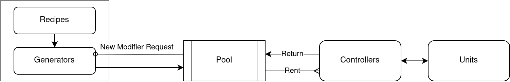

<p align="center">


</p>

<h1></h1>

[](https://godotengine.org/asset-library/asset/2166)
[](https://www.nuget.org/packages/ModiBuff/)


- [What is this?](#what-is-this)
- [Features](#features)
- [RoadMap](#roadmap)
- [Benchmarks](#benchmarks)
- [Requirements](#requirements)
- [Installation](#installation)
- [Usage](#usage)
	- [Recipe](#recipe)
	- [Adding Modifiers to Units](#adding-modifiers-to-units)
	- [Effect](#effect)
	- [Serialization](#serialization)
- [FAQ](#faq)
- [Examples](#examples)
- [Differences to ModiBuffEcs and Old](#differences-to-modibuffecs-and-old)

# What is this?

This zero dependency, engine-agnostic library was made to make a standardized powerful system that allows for
manipulation of effects on entities.

**It focuses on Feature Set, Performance and Ease of use, in that order.**

**Library goals:**

* Capable of creating very sophisticated modifiers
* Modifiers being fast
* Creating them easily

The library is split into two core parts:

ModiBuff is the core backend part that handles all the modifier logic and is mostly unopinionated when it comes to the
game logic.

Meanwhile ModiBuff.Units is a fully featured implementation of the library, that showcases how to tie the library into a
game.

> Note: The library is currently in development, and it will most likely encounter breaking API changes.

## Why do I need this?

The vast majority of games make their own buff/debuff systems, to fit their game logic.
Examples of this are: Dota 2, League of Legends, Path of Exile, Diablo, World of Warcraft, etc.

While this is a great approach, it's also very time consuming, and requires a fair amount of research to design well.

This library solves that, but also allows for more complex and deeper modifiers than the aforementioned games.

# Features

* No GC/runtime heap allocations (fully pooled with state reset)
* Low memory usage (2-5 MB for 10_000 modifiers)
* Fast effects [10_000 damage modifiers in 0.24ms](#benchmarks)
* Fast iteration [10_000 interval modifiers & 10_000 units in 1.37ms](#benchmarks)
* Easy high level API [recipes](#recipe)
* Instance Stackable modifiers (multiple instances of the same modifier type)
* Effects on actions
	* Init
	* Interval
	* Duration
	* Stack
	* Callbacks (any user logic, support mutable and serializable state inside)
		* Unit callbacks/events (ex. When Attacked/Cast/Killed/Healed/Stunned/Silenced, On Attack/Cast/Kill/Heal)
		* Effect callbacks
		* Custom signature callbacks
* Effect implementation examples
	* Damage (& self damage)
	* Heal
	* Status effects (stun, silence, disarm, etc.) & immunity
	* [Multi instance Status effects](https://github.com/Chillu1/ModiBuff/blob/905fff885dc45c4e31df03d8b995a82d40f24042/ModiBuff/ModiBuff.Units/Effects/StatusEffectEffect.cs)
	  [impl](https://github.com/Chillu1/ModiBuff/blob/905fff885dc45c4e31df03d8b995a82d40f24042/ModiBuff/ModiBuff.Units/StatusEffect/MultiInstanceStatusEffectController.cs)
	  (2 same stuns, 2 different sources, unique timers)
	* Dispel status effect(s)
	* Add stat (Damage, Heal)
	* Actions (Attack, Heal, Cast, etc.)
	* Centralized Effect
	* And more, see [the rest](ModiBuff/ModiBuff.Units/Effects)
* Internal Effects
	* [Special Applier (another Modifier)](#applier-effect)
		* Applying Applier Modifiers as Applier Modifiers
	* Modifier Action (refresh, reset stacks, custom stack)
	* Remove (remove modifier)
	* Revert Action
* Modifierless-Effects
* Meta & Post effect manipulation (ex. lifesteal)
* Stack Logic
	* Custom (callback/interval/duration triggers)
	* Stack timer
	* Independent stack timers
	* Revertable independent stacks
* Condition implementations (checks)
	* Chance 0-100%
	* Cooldown
		* Charges (multiple use with cooldown)
	* Health/Mana cost, flat & percent
	* General:
		* Stat (health/mana/damage) >/=/< than X
		* Stat is full/empty
		* Has LegalAction (can attack, cast spell, move, etc.)
		* Has StatusEffect (stunned, silenced, disarmed, etc.)
		* Has Modifier
* Applier Modifiers
	* OnAttack
	* Cast
* Fully revertible effects
* Manual modifier generation (for full control)
* Open generic serialization (of all mutable state and id's)
	* System.Text.Json

# RoadMap

| V0.4.0-V0.?.0                                   | V1.0.0                                                         |
|-------------------------------------------------|----------------------------------------------------------------|
| GenId based<br/>modifier stacking               | Fully released open source<br/>game using ModiBuff at its core |
| Proper game samples<br/>(Godot and maybe Unity) | 98% of game mechanics<br/>implementable                        |
| Improved Appliers API?                          | ...                                                            |

# Benchmarks

TL;DR: It's fast. Takes 1ms± to add & update 10000 modifiers every frame.

BenchmarkDotNet v0.13.6, EndeavourOS  
Intel Core i7-4790 CPU 3.60GHz (Haswell), 1 CPU, 8 logical and 4 physical cores  
.NET SDK 6.0.120  
.NET 6.0.20 (6.0.2023.36801), X64 RyuJIT AVX2

**N: 10_000**  
Delta: 0.0167 * N

#### Add/Apply/Update Modifier table

Pre-allocated Pools

| Library                                               | NoOp*<br/>(1 unit) | Apply<br/>InitDmg<br/>(1 unit) | Apply<br/>InitStackDmg<br/>(1 unit) | Apply Multi<br/>instance DoT |
|-------------------------------------------------------|--------------------|--------------------------------|-------------------------------------|------------------------------|
| ModiBuff (this)                                       | 0.18ms, 0 B        | 0.26ms, 0 B                    | 0.44ms, 0 B                         | 1.01ms, 0 B                  |
| [ModiBuffEcs](https://github.com/Chillu1/ModiBuffEcs) | ?                  | 1.02ms, 0 GC                   | ?                                   | X                            |
| [Old](https://github.com/Chillu1/ModifierLibrary)     | ?                  | 21.4ms, 24 GC                  | ?                                   | X                            |

| Library                                               | Update DoT**<br/>(10_000 units, N:1) | Update Instance<br/>Stackable DoT |
|-------------------------------------------------------|--------------------------------------|-----------------------------------|
| ModiBuff (this)                                       | 1.96ms, 0 B                          | 0.13ms, 0 B                       |
| [ModiBuffEcs](https://github.com/Chillu1/ModiBuffEcs) | 0.44ms, 0 B                          | X                                 |
| [Old](https://github.com/Chillu1/ModifierLibrary)     | ?                                    | X                                 |

#### New Modifier/Pool table

| Library                                               | DoT pool rent | DoT pool<br/>reset return |
|-------------------------------------------------------|---------------|---------------------------|
| ModiBuff (this)                                       | 0.04ms, 0 B   | 0.18ms, 0 B               |
| [ModiBuffEcs](https://github.com/Chillu1/ModiBuffEcs) | 1.64ms, 0 GC  | 4.26ms, 0 GC              |
| [Old](https://github.com/Chillu1/ModifierLibrary)     | X             | X                         |

> Important: Non-pool ("New") benchmarks below don't matter for runtime performance in ModiBuff and ModiBuffEcs, since
> it will only be
> slower when allocating the new modifiers in the pools. Which if handled correctly, should only happen on
> initialization.

| Library                                               | New<br/>InitDmg<br/>Manual | New<br/>InitDmg<br/>Recipe | New<br/>DoT*<br/>Recipe |
|-------------------------------------------------------|----------------------------|----------------------------|-------------------------|
| ModiBuff (this)                                       | 0.54ms, 2.2 MB             | 1.44ms, 2.8 MB             | 2.99ms, 6.0 MB          |
| [ModiBuffEcs](https://github.com/Chillu1/ModiBuffEcs) | X                          | 10.4ms,   2 GC             | 16.7ms,   2 GC          |
| [Old](https://github.com/Chillu1/ModifierLibrary)     | 92.0ms,  90 GC             | X                          | 140 ms, 126 GC          |

Setting up all recipes, with 64 pool allocation per recipe takes 60ns, and 104KB.

Pre-allocating 1_000 modifiers of each recipe (currently 100±) takes 67ms, and 35MB.

Pooling in ModiBuff is 500X faster than original old version (because of pool rent & return)  
But it's also much faster in cases of doing init/stack/refresh on an existing modifier (we don't create a new modifier
anymore)  
ModiBuffEcs is a bit on the slow side for now, because of how pooling works, with enabling and disabling entities.

*NoOp is an empty effect, so it just measures the benchmark time of the library without unit logic (ex. taking
damage).  
**DoT = InitDoTSeparateDamageRemove

# Requirements

ModiBuff is compatible with .NETStandard 1.1 and .NETStandard 2.0, C# 7.2 (C# 7.0 is also possible, take a look
at [Godot Branch](https://github.com/Chillu1/ModiBuff/tree/godot))

For development net 6.0 is required to build and run all tests. The tests depend on NUnit, and benchmarks depend on
BenchmarkDotNet.

# Installation

Currently the library is on [NuGet](https://www.nuget.org/packages/ModiBuff/) and
[Godot Asset Library](https://godotengine.org/asset-library/asset/2166), it will also be coming to Unity Asset Store
at some point.

> Note: It's recommended to use the source/non-DLL/debug version of the library in development, since it has
> useful logging/debugging features.

## Unity

Install package from git url: https://github.com/Chillu1/ModiBuff.git#upm

## Step by step installation

1. Download the latest DLL from [Releases](https://github.com/Chillu1/ModiBuff/releases) or ModiBuff source code.
2. Add the DLL to your project.
3. Make your own `ModifierRecipes` class that either
   [inherits](https://github.com/Chillu1/ModiBuff/blob/905fff885dc45c4e31df03d8b995a82d40f24042/ModiBuff/ModiBuff.Units/TestModifierInheritanceRecipes.cs)
   from `ModiBuff.ModifierRecipes`or
   [encapsulates](https://github.com/Chillu1/ModiBuff/blob/905fff885dc45c4e31df03d8b995a82d40f24042/ModiBuff/ModiBuff.Units/TestModifierRecipes.cs)
   it and fill it with your modifier recipes.
4. Make your own logger implementation, by inheriting `ILogger`, or use one of the built-in ones.
5. Call ModiBuff setup systems in the initialization of your game.    
   5.1. You can change the internal config values inside `Config`

```csharp
Logger.SetLogger<MyLogger>();
//Config.MaxPoolSize = 10000;

var idManager = new ModifierIdManager();
_recipes = new ModifierRecipes(idManager); //Your version of ModifierRecipes
_pool = new ModifierPool(_recipes);
```

If you want to use the Units implementation, go to [ModiBuff.Units](#modibuffunits).
Otherwise go to [Custom Units](#custom-units).

### ModiBuff.Units

6. Download the latest ModiBuff.Units DLL from [Releases](https://github.com/Chillu1/ModiBuff/releases) or ModiBuff
   source code.
7. Add the DLL to your project.
8. Now you can create your units, and apply modifiers to them.

### Custom Units

6. Implement `IUnit` and `IModifierOwner` interfaces on your unit class.  
   6.1. Optionally add some of the ModiBuff.Units `IUnit` [interfaces](ModiBuff/ModiBuff.Units/Unit/Interfaces) that you
   want to use.
7. Create your own interfaces that your effects will use, and implement them on your unit class.

# Usage

> Important: this readme is updated often, and is usually on par with the master branch code.
> If you're not using master branch code, go to [V0.3.0](https://github.com/Chillu1/ModiBuff/tree/0.3.0#usage)
> or [V0.2.0](https://github.com/Chillu1/ModiBuff/tree/0.2.0#usage) readme versions for the most accurate usage.

## Recipe

Modifier Recipes are the high level API for creating modifiers, they use the builder pattern/method chaining/fluent
interface to create modifiers (without the need for calling a Finish/Complete method).

Easiest modifier, that does 5 damage when added, can be created like this:

```csharp
Add("InitDamage")
    .Effect(new DamageEffect(5), EffectOn.Init);
```

More advanced damage over time modifier, with 10 damage when added, and 5 damage per interval.  
Removed after 3 seconds, with the duration being refreshable.

```csharp
Add("Init_DoT_Remove_Refreshable")
    .Interval(1)
    .Effect(new DamageEffect(10), EffectOn.Init)
    .Effect(new DamageEffect(5), EffectOn.Interval)
    .Remove(3)
    .Refresh();
```

You're also able to create modifiers with same effect instance on multiple actions.  
Ex. Same damage on Init and Interval.
> Note: init will be triggered each time we try to add the modifier to the unit (unless we set `.OneTimeInit()`).

```csharp
Add("InitDoT")
    .Interval(1)
    .Effect(new DamageEffect(10), EffectOn.Init | EffectOn.Interval);
``` 

Any IEffect can be added.  
Ex. simple stun effect

```csharp
Add("InitStun")
    .Effect(new StatusEffectEffect(StatusEffectType.Stun, 2), EffectOn.Init)
    .Remove(2);
```

## In-depth Recipe Creation

Every modifier needs a unique name.
It will be registered under this name in the backend,
and assigned an unique ID.

```csharp
Add("ModifierName")
```

Recipes have a methods that determine the functionality of the made modifier.

### Recipe Effect

The main method to setup effects is `Effect(IEffect, EffectOn)`.  
`IEffect` is the effect that will be applied to the unit, it can be anything, as long as it implements IEffect
interface.  
`EffectOn` is the action that will trigger the effect: Init, Interval, Duration, Stack.
`EffectOn` is a flag enum, so the effect can be triggered on multiple actions.  
`Targeting` tells the effect how it should be targeted, if we should target the owner (source) of the modifier, or the
targeted unit.
If you're unsure what this means, leave it at default. There will be more examples of this later.

```csharp
Add("InitDamage")
    .Effect(new DamageEffect(5), EffectOn.Init);
```

### Interval

The first most common action method is `Interval(float)`. It's used to set the interval of the modifier.
And interval effects will be triggered every X seconds.

```csharp
Add("IntervalDamage")
    .Interval(1)
    .Effect(new DamageEffect(5), EffectOn.Interval);
```

### Duration

Next is `Duration(float)`. It's used to set the duration of the duration effects. It's usually used to remove the
modifier after X seconds.
But it can be used for any effect.

```csharp
Add("InitDamageDurationRemove")
    .Effect(new DamageEffect(5), EffectOn.Init)
    .Effect(new RemoveEffect(), EffectOn.Duration)
    .Duration(5);
```

> Note: When we want to remove the modifier after X seconds, it's simpler to use the `Remove(float)` method,
> which is just a QoL wrapper for `Duration(float)`.

```csharp
Add("InitDamageDurationRemove")
    .Effect(new DamageEffect(5), EffectOn.Init)
    .Remove(5);
```

### Refresh

Then we have `Refresh(RefreshType)` method. That makes either the interval or duration component refreshable.
Meaning that if a modifier gets added again to a unit, it will refresh the timer. This is most often used with the
duration timer.

```csharp
Add("DamageOverTimeRefreshableDuration")
    .Interval(1)
    .Effect(new DamageEffect(5), EffectOn.Interval)
    .Effect(new RemoveEffect(), EffectOn.Duration)
    .Duration(5)
    .Refresh(RefreshType.Duration);
```

Calling `Refresh()` without any arguments will make the last time (interval/duration) component refreshable.

```csharp
Add("DamageOverTimeRefreshableDuration")
    .Interval(1)
    .Effect(new DamageEffect(5), EffectOn.Interval)
    .Effect(new RemoveEffect(), EffectOn.Duration)
    .Duration(5).Refresh();
```

### Stack

Then there's
`Stack(WhenStackEffect whenStackEffect, int maxStacks, int everyXStacks, float singleStackTime, float independentStackTime)`.
It's used for tracking how many times the modifier has been re-added to the unit, or other stacking logic.

`WhenStackEffect` tells the modifier when the stack action should be triggered: Always, OnMaxStacks, EveryXStacks,
etc.  
`MaxStacks` limits on how many stacks the modifier can have.  
`EveryXStacks` makes it possible to trigger the stack action every X stacks.  
`SingleStackTime` adds a single stack timer, that will remove and revert all stacks after X seconds.
Unless refreshed through a stack action.  
`IndependentStackTime` adds a stack timer for each stack, that will remove and revert a single stack every X seconds.
Independent stacks are non-refreshable.

Most stack effects also have a `StackEffectType` parameter, that tells the effect what to do when the stack action is
triggered. It can triggers the effect, add some kind of value to the effect, or other custom logic.

In this example we deal 5 damage every 1 second, but each time we add the modifier, we add 2 damage to the effect.
Resulting in 7 damage every 1 second with 1 stack. 9 with 2 stacks, etc.

```csharp
Add("StackableDamage_DamageOverTime")
    .Interval(1)
    .Effect(new DamageEffect(5, StackEffectType.Add, 2), EffectOn.Interval)
    .Stack(WhenStackEffect.Always);
```

### OneTimeInit & Aura

`OneTimeInit()` makes the modifier only trigger the init effect once, when it's added to the unit.
Any subsequent adds will not trigger the init effects, but refresh and stack effects will still work as usual.
This is very useful for aura modifiers, where we don't want to stack the aura effect.

> After commit [d3cb4a6](https://github.com/Chillu1/ModiBuff/commit/d3cb4a6220ff0ea0260750b68f451bc06091332e)
> aura handling was refactored and improved.

We can tell the recipe that it will trigger effects on multiple units at once
with `Aura()`. We can also specify multiple aura Ids, which can be used as range dictionaries instead.

```csharp
Add("InitAddDamageBuff")
    .OneTimeInit() // EffectState.IsRevertibleAndTogglable can be used instead of OneTimeInit
    .Effect(new AddDamageEffect(5, EffectState.IsRevertible), EffectOn.Init)
    .Remove(1.05f).Refresh();
Add("InitAddDamageBuff_Interval")
    .Aura()
    .Interval(1)
    .Effect(new ApplierEffect("InitAddDamageBuff"), EffectOn.Interval);
```

### InstanceStackable

`InstanceStackable()` makes the modifier instance stackable, meaning that we can have
multiple instances of the same modifier on the same unit.

This will impose a slight performance penalty, and will require to use unique `genId` for each instance.

This example deals 5 damage every 1 second, the remove timer can't be refreshed by normal means.
And each new call to add the modifier will add a new instance of the modifier.

```csharp
Add("InstanceStackableDoT")
    .InstanceStackable()
    .Interval(1)
    .Effect(new DamageEffect(5), EffectOn.Interval)
    .Remove(5);
```

### Meta-Effect

Effects can store meta effects, that will manipulate the effect values with optional conditions.
Meta effects, just like normal effects, are user-generated. Note that meta-effect can't have **mutable** state.
Any mutable state should be stored in the effect itself or on the unit.
Effects support using many meta effects after each other. Allowing for very complex interactions.

This example scales our 5 damage value based on the source unit's health multiplied by it.

```csharp
Add("InitDamageValueBasedOnHealthMeta")
    .Effect(new DamageEffect(5)
        .SetMetaEffects(new StatPercentMetaEffect(StatType.Health, Targeting.SourceTarget)), EffectOn.Init);
```

### Post-Effect

Post-effects can be chained with meta-effects.

Post effects are effects that are applied after the main effect. And use the main effect as a source for their values.
Most common example of this is lifesteal, where we deal damage, and then heal for a percentage of the damage dealt.
Post effects also can't have any mutable state, and work fully in conjunction with meta effects.

This example deals 5 damage on init, and then heals for 50% of the damage dealt.

```csharp
Add("InitDamageLifeStealPost")
    .Effect(new DamageEffect(5)
        .SetPostEffects(new LifeStealPostEffect(0.5f, Targeting.SourceTarget)), EffectOn.Init);
```

### Apply & Effect Condition (checks)

Modifiers can have conditions, that will check if the modifier/target/source fulfills the condition before applying the
modifier.
`ModiBuff.Units` has a few built-in conditions, and custom conditions are fully supported.
The common conditions are: cooldown, mana cost, chance, status effect, etc.

This example deals 5 damage on init apply, only if:
the source unit has at least 5 mana (uses up that mana), has at least 10% hp (uses up the hp),
passes the 50% roll, is not on 1 second cooldown, source is able to act (attack, heal), and target is silenced.

```csharp
Add("InitDamage_CostMana")
    .ApplyCost(CostType.Mana, 5)
    .ApplyCostPercent(CostType.Health, 0.1f)
    .ApplyChance(0.5f)
    .ApplyCooldown(1f)
    .ApplyCondition(LegalAction.Act)
    .EffectCondition(LegalAction.Silence)
    .Effect(new DamageEffect(5), EffectOn.Init);
```

There's also `ChargeCooldown` that works like normal cooldown, but with charges.

```csharp
Add("InitDamage_ChargesCooldown")
    .ApplyChargesCooldown(cooldown: 1, charges: 2)
    .Effect(new DamageEffect(5), EffectOn.Init);
```

### Callback

> As of commit [a8ad4a6](https://github.com/Chillu1/ModiBuff/commit/a8ad4a6e962d21061b4beca4533f5581f6289106)
> (after V0.3.0), events were removed, and replaced entirely with callbacks. They're entirely the same.

Callbacks are a way to call effects on certain unit events.
Examples of some are: When Attacked, When Killed, On Attack, On Kill, On Cast, etc.

Some common examples of this are: thorns, restore health on cast, add damage on kill.

Callbacks are the most powerful tool to use together with game logic, they can use data sent through the event,
and have mutable serializable state inside it.

Callbacks are a way to add logic that can be triggered on any user/game-based action.
This is particularly useful for removing modifiers on certain non-standard cases.

In this example we add 5 damage to unit on Init, and the modifier can only be removed if the unit gets hit by a "
StrongHit".
Essentially a hit that deals more than half units health in damage (ex. game logic).

> Important: there can only be one callback `CallbackUnit` per modifier, but there can be
> multiple effects that trigger on that callback.

```csharp
Add("InitAddDamageRevertibleHalfHealthCallback")
    .Effect(new AddDamageEffect(5, EffectState.IsRevertible), EffectOn.Init)
    .Remove(RemoveEffectOn.CallbackUnit)
    .CallbackUnit(CallbackUnitType.StrongHit);
```

It's possible to use any IEffect for callbacks,
so we can for example heal the unit to full health every time they get hit by a "StrongHit".

```csharp
Add("InitHealToFullWhenStrongHitCallback")
    .Effect(new HealEffect(0)
        .SetMetaEffects(new AddValueBasedOnStatDiffMetaEffect(StatType.MaxHealth)), EffectOn.Callback)
    .CallbackUnit(CallbackUnitType.StrongHit);
```

There's another version of callbacks, based on delegates instead of IEffects.
It can be useful for simple one-off effects.

```csharp
Add("InitHealToFullHalfHealthCallback")
    .Callback(CallbackType.StrongHit, (target, source) =>
    {
        var damageable = (IDamagable<float, float>)target;
        ((IHealable<float, float>)target).Heal(damageable.MaxHealth - damageable.Health, source);
    });
```

> Note that no effect or state can be defined or saved here, being mostly a downside.

#### Callback with mutable state

It's possible for callbacks to have internal mutable state, but this state should be handled carefully.
It's important to reset the state when our condition is met first, before we trigger any effects.

In this example every time unit's health changes, we add that change to our total, and when we reach 10 damage taken,
we deal 5 damage to the unit.

The point of `CallbackStateContext` is to encapsulate state, and have read/write access to it for serialization
purposes.

```csharp
Add("InitTakeFiveDamageOnTenDamageTaken")
    .Callback(CallbackType.CurrentHealthChanged, () =>
    {
        float totalDamageTaken = 0f;

        return new CallbackStateContext<float>(new HealthChangedEvent(
            (target, source, health, deltaHealth) =>
            {
                if (deltaHealth > 0)
                    totalDamageTaken += deltaHealth;
                if (totalDamageTaken >= 10)
                {
                    totalDamageTaken = 0f;
                    target.TakeDamage(5, source);
                }
            }), () => totalDamageTaken, value => totalDamageTaken = value);
    });
```

#### Callback Effect

`CallbackEffect` are special callbacks that trigger on `EffectOn.CallbackEffect` effects.
These callbacks get the effect fed as a parameter, this allows for condtional effect invoking, or custom effect use,
like manual stack trigger. Supports custom callback signatures.

> Important: all versions before 0.4/latest master can only have one callback `CallbackEffect` per modifier.

```csharp
Add("SilenceSourceWhenSilenced")
    .Effect(new StatusEffectEffect(StatusEffectType.Silence, 2f), EffectOn.CallbackEffect)
    .CallbackEffect(CallbackType.StatusEffectAdded, effect =>
        new StatusEffectEvent((target, source, appliedStatusEffect, oldLegalAction, newLegalAction) =>
        {
            if (appliedStatusEffect.HasStatusEffect(StatusEffectType.Silence))
                effect.Effect(source, target);
        }));
```

It's possible to have mutable state in this callback as well.

```csharp
Add("StunnedFourTimesDispelAllStatusEffects")
    .Effect(new DispelStatusEffectEffect(StatusEffectType.All), EffectOn.CallbackEffect)
    .CallbackEffect(CallbackType.StatusEffectAdded, effect =>
    {
        float totalTimesStunned = 0f;
        return new CallbackStateContext<float>(
            new StatusEffectEvent((target, source, statusEffect, oldLegalAction, newLegalAction) =>
            {
                if (statusEffect.HasStatusEffect(StatusEffectType.Stun))
                {
                    totalTimesStunned++;
                    if (totalTimesStunned >= 4)
                    {
                        totalTimesStunned = 0f;
                        effect.Effect(target, source);
                    }
                }
            }), () => totalTimesStunned, value => totalTimesStunned = value);
    })
```

### Multiple callbacks

As of commit [a8ad4a6](https://github.com/Chillu1/ModiBuff/commit/a8ad4a6e962d21061b4beca4533f5581f6289106)
(after V0.3.0) the recipe system supports up to 4 different callbacks for each `EffectOn.Callback` type.

The signature becomes `EffectOn.Callback`, `EffectOn.Callback2`, etc.
Note that the callback order matters, callbacks are sequential, first registered callback will be marked as first.
Same callback type can be registered multiple times, with different event signatures.

CallbackEffect example:

Damage whenever target get's stunned, and heal whenever a status effect expires/gets removed that's not a stun.

```csharp
Add("DamageOnStun_HealOnAnyNotStunStatusEffectRemoved")
    .Effect(new DamageEffect(5), EffectOn.CallbackEffect)
    .CallbackEffect(CallbackType.StatusEffectAdded, effect =>
        new StatusEffectEvent((target, source, appliedStatusEffect, oldLegalAction, newLegalAction) =>
        {
            if (appliedStatusEffect.HasStatusEffect(StatusEffectType.Stun))
                ((ICallbackEffect)effect).CallbackEffect(target, source);
        }))
    .Effect(new HealEffect(5), EffectOn.CallbackEffect2)
    .CallbackEffect(CallbackType.StatusEffectRemoved, effect =>
        new StatusEffectEvent((target, source, appliedStatusEffect, oldLegalAction, newLegalAction) =>
        {
            if (!appliedStatusEffect.HasStatusEffect(StatusEffectType.Stun))
                ((ICallbackEffect)effect).CallbackEffect(target, source);
        }));
```

### Modifier Actions

Sometimes we need extra control of what happens inside the modifier, with game logic.
This can be achieved with modifier actions, currently there's three: Refresh, ResetStacks and CustomStack.

Here we have a delayed add damage, that triggers after 2 seconds.
But if a unit takes a "StrongHit", it will reset the timer.

```csharp
Add("DurationAddDamageStrongHitRefresh")
    .Effect(new AddDamageEffect(5), EffectOn.Duration)
    .ModifierAction(ModifierAction.Refresh, EffectOn.Callback)
    .Callback(CallbackType.StrongHit)
    .Duration(2).Refresh();
```

Here we add damage every 5 stacks of the modifier.
But if a unit takes a "StrongHit", it will reset the stacks count to 0.

```csharp
Add("StackAddDamageStrongHitResetStacks")
    .Effect(new AddDamageEffect(5), EffectOn.Stack)
    .ModifierAction(ModifierAction.ResetStacks, EffectOn.Callback)
    .Callback(CallbackType.StrongHit)
    .Stack(WhenStackEffect.EveryXStacks, everyXStacks: 5);
```

Custom stack is an experimental modifier action, that might be removed in the future.
It allows to trigger the stack action as an modifier action.

Ex. every 4th stun, dispel all status effects.

```csharp
Add("StunnedFourTimesDispelAllStatusEffects")
    .Tag(TagType.CustomStack)
    .Stack(WhenStackEffect.EveryXStacks, everyXStacks: 4)
    .Effect(new DispelStatusEffectEffect(StatusEffectType.All), EffectOn.Stack)
    .ModifierAction(ModifierAction.Stack, EffectOn.CallbackEffect)
    .CallbackEffect(CallbackType.StatusEffectAdded, effect =>
        new StatusEffectEvent((target, source, statusEffect, oldLegalAction, newLegalAction) =>
        {
            if (statusEffect.HasStatusEffect(StatusEffectType.Stun))
                effect.Effect(target, source);
        }));
```

### Remove Applier

It's possible to remove added appliers through recipes as well.
We just need to specify applier type, and if it has any apply checks (ex. like chance, cooldown, etc.).

```csharp
Add("AddApplier_Effect")
    .Effect(new ApplierEffect("InitDamage"), EffectOn.Init)
    .RemoveApplier(5, ApplierType.Cast, false);
```

### Dispel

ModiBuff currently contains an internal dispel system, that doesn't yet allow for custom dispel logic through it.

```csharp
Add("BasicDispellable")
    .Dispel(DispelType.Basic)
    .Effect(new DamageEffect(5), EffectOn.Init);

IModifierOwner.Dispel(DispelType dispelType, IUnit source)
```

It's recommended to make your own dispel system inside the unit for better control, if needed.
Ex. through tags and callbacks.

```csharp
Add("InitStatusEffectSleep_RemoveOnDispel")
    .Tag(TagType.BasicDispel)
    .Effect(new StatusEffectEffect(StatusEffectType.Sleep, 5f, true), EffectOn.Init)
    .Remove(RemoveEffectOn.CallbackEffect)
    .CallbackEffect(CallbackType.Dispel, removeEffect =>
        new DispelEvent((target, source, eventTag) =>
        {
            if ((TagType.BasicDispel & eventTag) != 0)
                removeEffect.Effect(target, source);
        }))
```

### Tags

Tags are a way to mark modifiers, there are a few internal tags that tell the `ModifierController` how the modifiers
should be handled. Tags are stored inside `ModifierRecipes` and can only be set on modifier generator creation.

Then there's a few other internal tags that are there for the user:
`IsInstanceStackable`, `IntervalIgnoresStatusResistance` and `DurationIgnoresStatusResistance`.
There's also automatic tagging for manual modifier generation of: `IsInit`, `IsStack`, and `IsRefresh`.

There's also a `TagType.Default` which we can use in the beginning to define our default tags in the config.
`Config.DefaultTag = /*Your*/TagType.Default;`

But tagging also supports user-defined tags, that can be used for any purpose.

`ModiBuff.Units` uses it to implement legal targeting for modifiers.
We need to respect the last reserved tag in `ModiBuff.Core.TagType`.

```csharp
[Flags]
public enum TagType : ulong
{
    Default = Core.TagType.Default | LegalTargetAll,

    LastReserved = Core.TagType.LastReserved,

    LegalTargetSelf = 1ul << 17,
    LegalTargetAlly = 1ul << 18,
    LegalTargetEnemy = 1ul << 19,

    LegalTargetAll = LegalTargetSelf | LegalTargetAlly | LegalTargetEnemy,
    //UserTag5 = 1ul << 21
}
```

Then we can define some helper extension methods for checking if a unit is a legal target of the modifier.

```csharp
public static bool IsLegalTarget(this int modifierId, IUnitEntity target, IUnitEntity source)
{
    var tag = (TagType)ModifierRecipes.GetTag(modifierId);
    if (tag.HasTag(TagType.LegalTargetSelf) && target == source)
        return true;

    return tag.IsLegalTarget(target.UnitType, source.UnitType);
}
```

```csharp
public static bool IsLegalTarget(this TagType tag, UnitType target, UnitType source)
{
    if (tag.HasTag(TagType.LegalTargetAlly) && target == source)
        return true;
    if (tag.HasTag(TagType.LegalTargetEnemy) && target != source)
        return true;
    if (tag.HasTag(TagType.LegalTargetAll))
        return true;

#if DEBUG
    Logger.Log($"Tag {tag} is not a legal target for UnitType.{target} from UnitType.{source}");
#endif
    return false;
}
```

So we can finally setup our own tag for modifiers.

> Note that we're also using a default tag that sets all modifiers to be legal to target all units.
> So we need to remove that tag first.

```csharp
Add("InitDamageEnemyOnly")
    .RemoveTag((Core.TagType)LegalTarget.All)
    .Tag((Core.TagType)TagType.LegalTargetEnemy)
    .Effect(new DamageEffect(5f), EffectOn.Init);
```

Then we can make a extension method for our logic, so we don't use the previous verbose `Tag` approach.

```csharp
public static ModifierRecipe LegalTarget(this ModifierRecipe recipe, LegalTarget target)
{
    recipe.RemoveTag((Core.TagType)TagType.LegalTargetAll);
    return recipe.Tag(target.ToTagType());
}
```

```csharp
Add("InitDamageEnemyOnly")
    .LegalTarget(LegalTarget.Enemy)
    .Effect(new DamageEffect(5f), EffectOn.Init);
```

### Custom Data

Sometimes the tag system is too limited for our needs. That's why every recipe stores a custom object, that can be
accessed from anywhere like the tag.
It is mostly designed to store basic information about the modifier, one example of this is adding a modifier to every
unit of type X (ex. Goblin).
Instead of storing that information on the goblin unit data itself, we delegate it to the modifiers, also no need for
arbitrary naming conventions this way.

```csharp
public enum EnemyUnitType
{
    Slime,
    Goblin,
    Orc,
}

public enum ModifierAddType
{
    Self = 1,
    Applier,
}

public record AddModifierCommonData<TUnit>(ModifierAddType ModifierType, TUnit UnitType);

Add("Damage")
    .Data(new AddModifierCommonData<EnemyUnitType>(ModifierAddType.Self, EnemyUnitType.Goblin))
    .Effect(new DamageEffect(5), EffectOn.Init);
```

It also allows for a more standardized recipe creation, by unit types, modifier types, etc, reducing code duplication.

```csharp
AddEnemySelfBuff("Damage", EnemyUnitType.Goblin)
    .Effect(new DamageEffect(5), EffectOn.Init);

ModifierRecipe AddEnemySelfBuff(string name, EnemyUnitType enemyUnitType, string displayName = "", string description = "") =>
    Add(name + enemyUnitType, displayName, description)
        .Data(new AddModifierCommonData<EnemyUnitType>(ModifierAddType.Self, enemyUnitType));
```

### Custom Stack

Stack is always triggered when we try to add the same type of modifier again.
This behaviour can be changed by using CustomStack logic. Modifier stack action might be removed/refactored in
a future release.

The most usual usage of this is to trigger the stack action on a custom case.
It's a way to glue callback logic to stacking behaviour.

Here we dispel all status effects if the unit has been stunned 4 times.

```csharp
Add("StunnedFourTimesDispelAllStatusEffects")
    .Tag(TagType.CustomStack)
    .Stack(WhenStackEffect.EveryXStacks, everyXStacks: 4)
    .Effect(new DispelStatusEffectEffect(StatusEffectType.All), EffectOn.Stack)
    .ModifierAction(ModifierAction.Stack, EffectOn.CallbackEffect)
    .CallbackEffect(CallbackType.StatusEffectAdded, effect =>
        new StatusEffectEvent((target, source, statusEffect, oldLegalAction, newLegalAction) =>
        {
            if (statusEffect.HasStatusEffect(StatusEffectType.Stun))
                effect.Effect(target, source);
        }));
```

Here we have a stacking heal that stacks based on the amount of times the unit has been stunned.
That stacking number gets reset every 10 seconds (interval), but the interval timer gets refreshed every time the unit
gets stunned. Also the heal itself isn't revertible, but the value we stack is.

```csharp
Add("StunHealStackReset")
    .Tag(Core.TagType.CustomStack)
    .Stack(WhenStackEffect.Always)
    .Effect(new HealEffect(0, HealEffect.EffectState.ValueIsRevertible,
        StackEffectType.Effect | StackEffectType.Add, 5), EffectOn.Stack)
    .CallbackEffect(CallbackType.StatusEffectAdded, effect =>
        new StatusEffectEvent((target, source, appliedStatusEffect, oldLegalAction, newLegalAction) =>
        {
            if (appliedStatusEffect.HasStatusEffect(StatusEffectType.Stun))
                effect.Effect(target, source);
        }))
    .ModifierAction(ModifierAction.ResetStacks, EffectOn.Interval)
    .ModifierAction(ModifierAction.Refresh | ModifierAction.Stack, EffectOn.CallbackEffect)
    .Interval(10).Refresh();
```

### Order

Functions should be used in the operation order, for clarity.
This is optional, except for parameterless refresh functions, which should be called right after interval/duration.

```csharp
Add("Full")
    .OneTimeInit()
    .ApplyCondition(ConditionType.HealthIsFull)
    .ApplyCooldown(1)
    .ApplyCost(CostType.Mana, 5)
    .ApplyChance(0.5f)
    .EffectCondition(ConditionType.HealthIsFull)
    .EffectCooldown(1)
    .EffectCost(CostType.Mana, 5)
    .EffectChance(0.5f)
    .Effect(new DamageEffect(5), EffectOn.Init)
    .Effect(new DamageEffect(5), EffectOn.Stack)
    .Stack(WhenStackEffect.EveryXStacks, everyXStacks: 2)
    .Interval(1)
    .Effect(new DamageEffect(2), EffectOn.Interval)
    .Remove(5).Refresh()
    .Effect(new DamageEffect(8), EffectOn.Duration);
```

Each modifier should have at least one effect, unless it's used as a flag.

## Recipe Limitations

> Note that these limitations don't matter for 95% of the use cases.

* One Interval Component
* One Duration Component
* One Modifier Check for all effects
* Same Checks (cost, chance, cooldown) for all effects

## Adding Modifiers To Units

For units to be able to use and own modifiers, they need to implement `IModifierOwner` interface.
A `ModifierControllerPool` should be used to avoid runtime heap allocations. The pool needs to be initialized manually.
Then it can be rented inside the unit like so: `ModifierController = ModifierControllerPool.Instance.Rent();`.

For units to be able to use and own modifier appliers, they need to implement `IModifierApplierOwner` interface.
It also has a pool, and works the same way as `ModifierController`.

There's multiple ways to add modifiers to a unit.

For normal modifiers, the best approach is to use `IModifierOwner.AddModifier(int id, IUnit source)`.
By feeding the modifier ID, and the source unit. These modifiers are stored and managed by `ModifierController`.

For applier (attack, cast, etc) modifiers,
`IModifierApplierOwner.ModifierApplierController.TryAddApplier(int id, bool hasApplyChecks, ApplierType applierType)`
should be used.

For aura modifiers, units need to store the aura collection of targets themselves.
Then they need to implement `IAuraOwner` so the modifiers can access these targets.

This is also the case for unit callbacks, like `OnKill`, `OnAttack`, `WhenDeath`, etc.
Through `ICallbackUnitRegistrable.RegisterCallbacks(TCallbackUnit, IEffect[])`.

## Effect

[Skip effect creation](#applier-effect)

### Making New Effects

The library allows for easy creation of new effects.
Which are needed for using custom game-based logic.

Effects have to implement `IEffect`.  
They can also implement `IStackEffect` for stacking functionality, `IStateEffect` for resetting runtime state.

For fully featured effect implementation, look at
[DamageEffect](https://github.com/Chillu1/ModiBuff/blob/905fff885dc45c4e31df03d8b995a82d40f24042/ModiBuff/ModiBuff.Units/Effects/DamageEffect.cs)

#### In-depth Effect Creation

We start by creating a new class that implements `IEffect`.  
`IEffect` has a method `void Effect(IUnit target, IUnit source);` that gets fed the target and source of the
cast/attack/apply.

The next important thing is to identify if our effect will have mutable state.
It will have state if we plan on reverting it, adding more value to it, or changing internal effect state.
In that case, we need to implement `IStateEffect`, which has a method `void ResetState();` that gets called when the
modifier is sent back to pool, and also a clone `IEffect ShallowClone()` method. For cloning the effect so the state is
not shared between modifiers.

If we want to use stack logic, the effect needs to implement `IStackEffect`.

The effects hould have two constructors, the first main one should be used for recipes,
and only expose the non-recipe setting variables.
The other constructor should be in a factory pattern style, and expose all the variables.

##### Designing an Effect from scratch

Let's design a damage effect from scratch. It first needs to implement `IEffect`.

```csharp
public class DamageEffect : IEffect
{
    private readonly float _damage;

    public DamageEffect(float damage)
    {
        _damage = damage;
    }

    public void Effect(IUnit target, IUnit source)
    {
        ((IDamagable)target).TakeDamage(_damage, source);
    }
}
```

The changed parts are the only ones showed in new implementations.

Okay, but what if we want to be able to use the damage effect as thorns? As in the source should be the one damaged.
Not the target. We can do this by using `Targeting`.

```csharp
public class DamageEffect : IEffect
{
    private Targeting _targeting;

    public DamageEffect(float damage, Targeting targeting = Targeting.TargetSource)
    {
        _damage = damage;
        _targeting = targeting;
    }

    public void Effect(IUnit target, IUnit source)
    {
        _targeting.UpdateTargetSource(ref target, ref source);
        ...
    }
}
```

`_targeting.UpdateTargetSource(ref target, ref source);` just changes around who's the target and who's the source,

This way we can tell the effect who's the target (of the effect), and who's the source.
The original source can be both the target and source if desired (`Targeting.SourceSource`).

Okay, but what about adding state to the effect? Ex. extra damage on stack.
Before we implement this, we need to understand that stateful effects need special handling.

All stateful effects need to implement `IStateEffect`. `IStateEffect` needs three methods:  
`void ResetState();` resets the mutable state of the effect to it's default values.  
`IEffect ShallowClone();` clones the effect, so the state is not shared between modifiers.  
`object IShallowClone.ShallowClone();` is a object wrapper for the `ShallowClone()` method.

```csharp
public class DamageEffect : IEffect, IStateEffect
{
    private float _extraDamage;

    ...
        
    public void Effect(IUnit target, IUnit source)
    {
        ...
        ((IDamagable)target).TakeDamage(_damage + _extraDamage, source);
    }
    
    public void ResetState() => _extraDamage = 0;

    public IEffect ShallowClone() => new DamageEffect(_damage, _targeting);
    object IShallowClone.ShallowClone() => ShallowClone();
}
```

Now that we have modifier state, we can add stack logic to the effect.
This can be added through `IStackEffect`.

```csharp
public class DamageEffect : IEffect, IStateEffect, IStackEffect
{
    private readonly StackEffectType _stackEffect;
    private readonly float _stackValue;

    public DamageEffect(float damage, StackEffectType stackEffect, float stackValue, Targeting targeting)
    {
        _damage = damage;
        _stackEffect = stackEffect;
        _stackValue = stackValue;
        _targeting = targeting;
    }

    ...

    public void StackEffect(int stacks, IUnit target, IUnit source)
    {
        if ((_stackEffect & StackEffectType.Add) != 0)
            _extraDamage += _stackValue;

        if ((_stackEffect & StackEffectType.AddStacksBased) != 0)
            _extraDamage += _stackValue * stacks;

        if ((_stackEffect & StackEffectType.Effect) != 0)
            Effect(target, source);
    }

    ...
}
```

`StackEffectType` is a generic flag enum, that works with most stack logic, but not all, so feel free to make your own.

All right, but what about reverting the effect? We need to introduce a new variable to store how much the total value
changed.
We also need to implement `IRevertEffect`.

```csharp
public class DamageEffect : IEffect, IStateEffect, IStackEffect, IRevertEffect
{
    public bool IsRevertible { get; }

    private float _totalDamage;

    public DamageEffect(float damage, StackEffectType stackEffect,
        float stackValue, bool revertible, Targeting targeting)
    {
        _damage = damage;
        _stackEffect = stackEffect;
        _stackValue = stackValue;
        IsRevertible = revertible;
        _targeting = targeting;
    }

    public void Effect(IUnit target, IUnit source)
    {
        if (IsRevertible)
            _totalDamage += _damage + _extraDamage;
        
        ...
    }

    ...

    public void RevertEffect(IUnit target, IUnit source)
    {
        //Might be smart to have it's own RevertDamage method here, so we don't trigger damage based callbacks.
        //Or heal callbacks
        ((IDamagable)target).RevertDamage(_totalDamage, source);
        //((IDamagable)target).TakeDamage(-_totalDamage, source);
        _totalDamage = 0;
    }

    public void ResetState() 
    {
        _extraDamage = 0;
        _totalDamage = 0;
    }

    ...
}
```

Now let's look at post and meta effects.
`IMetaEffectOwner<TEffect, TInValue, TOutValue>` is a helper interface for adding meta effects to effects.
`IPostEffectOwner<TEffect, TInValue>` is a helper interface for adding post effects to effects.

```csharp
public class DamageEffect : IEffect, IStateEffect, IStackEffect, IRevertEffect,
    IMetaEffectOwner<DamageEffect, float, float>, IPostEffectOwner<DamageEffect, float>
{
    private IMetaEffect<float, float>[] _metaEffects;
    private IPostEffect<float>[] _postEffects;

    ...

    private DamageEffect(... , IMetaEffect<float, float>[] metaEffects, IPostEffect<float>[] postEffects)
    {
        ...
        _metaEffects = metaEffects;
        _postEffects = postEffects;
    }

    public DamageEffect SetMetaEffects(params IMetaEffect<float, float>[] metaEffects)
    {
        _metaEffects = metaEffects;
        return this;
    }

    public DamageEffect SetPostEffects(params IPostEffect<float>[] postEffects)
    {
        _postEffects = postEffects;
        return this;
    }

    public void Effect(IUnit target, IUnit source)
    {
        _targeting.UpdateTargetSource(ref target, ref source);

        float damage = _damage;

        if (_metaEffects != null)
            foreach (var metaEffect in _metaEffects)
                damage = metaEffect.Effect(damage, target, source);

        damage += _extraDamage;

        ...

        float returnDamageInfo = ((IDamagable)target).TakeDamage(damage, source);

        if (_postEffects != null)
            foreach (var postEffect in _postEffects)
                postEffect.Effect(returnDamageInfo, target, source);
    }

    ...

    public IEffect ShallowClone() =>
            new DamageEffect(_baseDamage, _stackEffect, _stackValue, _targeting, _metaEffects, _postEffects);

    ...
```

We're not always using or changing mutable state in our effects, in these cases we can clone only when needed.
`IMutableStateEffect` needs to be implemented, and it's property `UsesMutableState` needs to say if the effect is using
mutable state. `IMutableStateEffect` is already part of `IStateEffect`.

```csharp
public class DamageEffect : IEffect, IStateEffect, IStackEffect, IRevertEffect,
    IMetaEffectOwner<DamageEffect, float, float>, IPostEffectOwner<DamageEffect, float>,
    IMutableStateEffect
{
    public bool UsesMutableState => IsRevertible || _stackEffect.UsesMutableState();

    ...
}
```

Since we have mutable state in our effect, we probably want to serialize it.
To do that we need to implement `ISavableEffect<TEffect.SaveData>`.
This interface forces us to return and load an object that will holds the effects mutable state.
This object should be a readonly struct, and should be called `SaveData`.

```csharp
public class DamageEffect : IEffect, IStateEffect, IStackEffect, IRevertEffect,
    IMetaEffectOwner<DamageEffect, float, float>, IPostEffectOwner<DamageEffect, float>,
    IMutableStateEffect, ISavableEffect<DamageEffect.SaveData>
{
    ...
    
    public object SaveState() => new SaveData(_extraDamage);
    public void LoadState(object saveData) => _extraDamage = ((SaveData)saveData).ExtraDamage;

    public readonly struct SaveData
    {
        public readonly float ExtraDamage;

        public SaveData(float extraDamage) => ExtraDamage = extraDamage;
    }
```

### Unit logic implementation check

Target unit might not have the logic implemented that's needed for the effect to work.
`ModiBuff.Units` effects have a check for that, and if it doesn't it can log an error if desired.

Ex. if a unit doesn't have health/is damagable, we can either ignore the effect (by default), or log an error that
the effect was supposed to work (since either all our units should be damagable, or we have some other validation system
on top). These checks can be enabled with a preprocessor directive define `MODIBUFF_EFFECT_CHECK`.

```csharp
if (target is IAttackable<float, float> damagableTarget)
    //Effect logic
#if MODIBUFF_EFFECT_CHECK
else
    EffectHelper.LogImplError(effectTarget, nameof(IAttackable<float, float>));
#endif
```

### Applier Effect

Hands down, the most powerful effect is the ApplierEffect.  
It's used to apply other modifiers to units. While being able to use modifier logic, like stacks.  
This can create some very sophisticated modifiers:

```csharp
//WhenAttacked ApplyModifier. Every5Stacks this modifier adds a new ^ rupture modifier
Add("ComplexApplier_OnHit_Event")
    .Effect(new ApplierEffect("ComplexApplier_Rupture", Targeting.SourceTarget), EffectOn.CallbackUnit)
    .CallbackUnit(CallbackUnitType.WhenAttacked);

//rupture modifier, that does DoT. When this gets to 5 stacks, apply the disarm effect.
Add("ComplexApplier_Rupture")
    .Effect(new DamageEffect(5), EffectOn.Interval)
    .Effect(new ApplierEffect("ComplexApplier_Disarm"), EffectOn.Stack)
    .Stack(WhenStackEffect.EveryXStacks, everyXStacks: 5);

//Disarm the target for 5 seconds. On 2 stacks, removable in 10 seconds, refreshable.
Add("ComplexApplier_Disarm")
    .Effect(new StatusEffectEffect(StatusEffectType.Disarm, 5, false, StackEffectType.Effect), EffectOn.Stack)
    .Stack(WhenStackEffect.EveryXStacks, everyXStacks: 2)
    .Remove(10)
    .Refresh();
```

The next one is very complex, but it shows the power of the ApplierEffect.  
Obviously the effects can be whatever we want. Damage, Stun, etc.

Add damage on 4 stacks buff, that you give someone when they heal you 5 times, for 60 seconds.  
To clarify:

* Player heals ally 5 times, gets buff
* Player attacks an enemy 4 times, gets damage buff
* Player buff gets removed after 60 seconds

```csharp            
//Apply the modifier to source (healer) WhenHealed                                   
Add("ComplexApplier2_WhenHealed_Event")               
    .Effect(new ApplierEffect("ComplexApplier2_WhenHealed", Targeting.SourceTarget), EffectOn.CallbackUnit)
    .CallbackUnit(CallbackUnitType.WhenHealed);

//On 5 stacks, apply the modifier to self.
Add("ComplexApplier2_WhenHealed")                                                    
    .Effect(new ApplierEffect("ComplexApplier2_OnAttack_Event"), EffectOn.Stack)     
    .Stack(WhenStackEffect.EveryXStacks, everyXStacks: 5)
    .Remove(5).Refresh();

//Long main buff. Apply the modifier OnAttack.
Add("ComplexApplier2_OnAttack_Event")
    .Effect(new ApplierEffect("ComplexApplier2_WhenAttacked_Event"), EffectOn.CallbackUnit)
    .CallbackUnit(CallbackUnitType.OnAttack)
    .Remove(60).Refresh();

Add("ComplexApplier2_WhenAttacked_Event")
    .Effect(new ApplierEffect("ComplexApplier2_AddDamageAdd", Targeting.SourceTarget), EffectOn.CallbackUnit)
    .CallbackUnit(CallbackUnitType.WhenAttacked)
    .Remove(5).Refresh();

//On 4 stacks, Add Damage to Unit source (attacker).
Add("ComplexApplier2_AddDamageAdd")
    .Effect(new ApplierEffect("ComplexApplier2_AddDamage"), EffectOn.Stack)
    .Stack(WhenStackEffect.EveryXStacks, everyXStacks: 4)
    .Remove(5).Refresh();

//AddDamage 5, one time init, remove in 10 seconds, refreshable.
Add("ComplexApplier2_AddDamage")
    .OneTimeInit()
    .Effect(new AddDamageEffect(5, EffectState.IsRevertible), EffectOn.Init)
    .Remove(10).Refresh();
```

## Modifier

Modifiers are the core backend part of the library, they are the things that are applied to entities with effects on
certain actions. Ex. Init, Interval, Duration, Stack.  
You **CAN'T** use the Modifier class directly, use the recipe system.
Recipe system fixes a lot of internal complexity of setting up modifiers for you.

It's possible to make modifier directly by using `ManualModifierGenerator` class,
specifically `ModifierRecipes.Add(string, string, string, ModifierGeneratorFunc, Tag)` method.
But only do so if you really know what you're doing, and need that extra functionality like multiple interval/duration
components, separate condition checks, etc.

### Manual Modifier Generation

Manual modifier generation is not a "first-class citizen" in the library,
but it does support all the bleeding edge features that aren't supported in recipes yet.

Here's a basic implementation of the classic 5 damage on init modifier. First as recipe, then as manual modifier.

```csharp
Add("InitDamage")
    .Effect(new DamageEffect(5), EffectOn.Init);
```

We need to always supply a `TargetComponent`, and id, genId and name need to fed to the modifier.

```csharp
Add("InitDamageManual", "", "", (id, genId, name, tag) =>
{
    var initComponent = new InitComponent(false, new IEffect[] { new DamageEffect(5) }, null);

    return new Modifier(id, genId, name, initComponent, null, null, null,
        new SingleTargetComponent(), null);
}/*>Supply possible tags here<*/);
```

As we can see there's a lot of manual setup, but this gives us more control over the modifier.
We can have multiple interval and duration components, with different unique effects.

We don't need to tag if our effect is init, stack or refresh.
Since it's done automatically by the library through reflection.

Some effects have special constructors for manual modifier generation,
where you can supply the needed parameters directly.
For example effects that hold instance info.

```csharp
var effect = StatusEffectEffect.Create(id, genId, StatusEffectType.Sleep, 5f, true);
```

## Serialization

To correctly serialize data, two things need to be serialized: The identification, and the mutable state.

Mutable state is fully opened up for serialization through nested structs called `SaveData` in every object that has
mutable state.

This allows for easy serialization of objects through generic means, because the data is fully exposed.
Without extra need custom serialization logic inside the objects.

The identifiers might have also changed Id order, or new ones might have been added to the game, through things like dlc
or mods, so it's important to handle that correctly. Like mapping old Ids to new ones.
This is achieved by calling `LoadState(SaveData)` on controllers/managers,
[ModiBuff.Units.GameState](https://github.com/Chillu1/ModiBuff/blob/905fff885dc45c4e31df03d8b995a82d40f24042/ModiBuff/ModiBuff.Units/GameState.cs)
is a good example of this.

Any effect (mostly callback effects) that inherits from `IRegisterEffect` will be loaded automatically
on load (through init). This is done through `ModifierController.LoadState(SaveData, IUnit)`.

### JSON

ModiBuff currently supports JSON serialization through `System.Text.Json`.
To enable it in the library, you need to add a preprocessor directive define `MODIBUFF_SYSTEM_TEXT_JSON`.

This enables the constructor attributes on objects, that allow for deserialization.

An example `SaveController` is shown in `ModiBuff.Extensions.Serialization.Json`,
but it's essentially not needed at all.
Because the only things that's needed is to serialize the object with `JsonSerializer.Serialize(obj, _options);`
and have options have `IncludeFields = True`.

## Centralized Effects

Sometimes we want to have the effects be centralized, so they're affected and controlled in one place.
Common examples of this are singular effects of: Poison, Bleed, Wet, etc.
While ModiBuff wasn't designed for this, it's still possible to do, but at extra complexity cost.

> Note that this is possible to do in ModiBuff, but also harder than normal.
> While it's possible to do manage this, it might be better to create your own system for this.
> Unless you want some of the other features of ModiBuff.

The issue is that we need to store the state in the effect itself or the unit.
If we chose the unit, we're coupling together effect code with unit implementation (not good).
So let's settle with effect, an example of this is
[PoisonDamageEffect](https://github.com/Chillu1/ModiBuff/blob/905fff885dc45c4e31df03d8b995a82d40f24042/ModiBuff/ModiBuff.Units/Effects/PoisonDamageEffect.cs).
We store all the poison stacks and their owners inside a dictionary that's inside the effect.
We also need a custom `StackEffect` implementation for saving those stacks,
and a custom `Effect` function for when we should trigger applying the poison stacks.

There are some
[tests](https://github.com/Chillu1/ModiBuff/blob/905fff885dc45c4e31df03d8b995a82d40f24042/ModiBuff/ModiBuff.Tests/CentralizedCustomLogicTests.cs)
that show how one can use the centralized effects.

When using centralized effects, it often happens that we have custom state inside them.
And if we also want to serialize that data, we might need to implement a parser for it.
For example a dictionary of `int unitId` and `int stacks`:

```csharp
SerializationExtensions.AddCustomValueType<IReadOnlyDictionary<int, int>>(element =>
{
    var dictionary = new Dictionary<int, int>();
    foreach (var kvp in element.EnumerateObject())
        dictionary.Add(int.Parse(kvp.Name), kvp.Value.GetInt32());
    return dictionary;
});
```

Custom stack logic can also help us with implementing custom logic.
Here we use stacks to determine the amount of poison stacks.

```csharp
Add("HealPerPoisonStack")
    .Tag(Core.TagType.CustomStack)
    .Stack(WhenStackEffect.Always)
    .Effect(new HealEffect(0, HealEffect.EffectState.None,
        StackEffectType.Effect | StackEffectType.SetStacksBased, 1), EffectOn.Stack)
    .CallbackEffect(CallbackType.PoisonDamage, effect =>
        new PoisonEvent((target, source, stacks, totalStacks, damage) =>
        {
            effect.Effect(target, source);
        }))
    .ModifierAction(ModifierAction.Stack, EffectOn.CallbackEffect);
```

Also checkout [applier branch](https://github.com/Chillu1/ModiBuff/compare/master...feature/duration-add-modifier)
for applying extra different durations (undecided feature).

## Modifierless-Effects

Sometimes we don't want to need to use the entire functionality of modifiers, and only add a simple effect to a unit.
This can be done by registering an effect with a name. Modifierless-effects are mostly used for simple init effects.

> Note: Modifierless-effects **CANNOT** use mutable state. Because their not cloned or kept by the target/source unit.
> If we try to use mutable state that state will be shared between all units that the effect applied to.

Modifierless-effects work similarly to modifiers in both access and registering.

A simple 5 damage effect can be registered like this:

```csharp
AddEffect("5Damage", new DamageEffect(5f));
```

Effects can also be added as "castable" to the unit, and cast, like this:

```csharp
unit.ModifierApplierController.TryAddEffectApplier(effectId);

unit.TryCastEffect(effectId, target);
```

Modifiers that only use `init` and have no mutable state can almost always be transformed into modifierless-effects.

A common way to use modifierless-effects is to add one time effects as appliers.

```csharp
Add("AddApplier_Effect")
    .Effect(new ApplierEffect("InitDamage"), EffectOn.Init)
    .RemoveApplier(5, ApplierType.Cast, false);

AddEffect("AddApplier_ApplierEffect", new ApplierEffect("AddApplier_Effect", ApplierType.Cast, false));
```

Or combine two different effects together, so it's possible to trigger both on same cast, with different modifier
targets/owners.

This example uses centralized effects, where we apply poison and heal from the poison stacks. In one cast.

```csharp
Add(PoisonRecipe);
Add("PoisonHealHeal")
    .Stack(WhenStackEffect.Always)
    .Effect(new HealEffect(0, HealEffect.EffectState.None,
            StackEffectType.Effect | StackEffectType.SetStacksBased, 1)
        .SetMetaEffects(new AddValueBasedOnPoisonStacksMetaEffect(1f)), EffectOn.Stack);

AddEffect("PoisonHeal",
    new ApplierEffect("Poison"),
    new ApplierEffect("PoisonHealHeal", targeting: Targeting.SourceTarget));
```

# FAQ

Q: ModiBuff.Units seems to use excessive casting in effects. Why not have a master unit interface?  
A: This was a tough solution to make custom user effects work with their own unit implementations.
And not force users to implement all methods for functionality, where it's not used.

Q: How do I make "insert mechanic from a game" in ModiBuff?  
A: First check [ModifierExamples.md](ModifierExamples.md). Then if it isn't there, ask about how to make it in issues,
will make a better
platform for discussion if needed.

Q: It's 100% not possible to make "mechanic from a game" in ModiBuff.  
A: If the mechanic is lacking internal ModiBuff functionality to work, and isn't an effect implementation problem, make
an issue about it. The goal of ModiBuff is to support as many unique mechanics as possible,
that don't rely on game logic.

Q: Why can't effects hold some kind of state? How else can I achieve this?  
A: Feeding mutable (non-stack) state to effects would introduce way too much complexity.
Instead we achieve this by using meta effects, and post effects on a secondary entity.
An example of this is a
[projectile](https://github.com/Chillu1/ModiBuff/blob/d0ba95f8f0696572b9cfb4f3e1374c2fc5f57726/ModiBuff/ModiBuff.Tests/StateTests.cs#L270-L277).
It is possible to have (non-stack) mutable state in effects, but it's almost always a bad idea, unless you're working
with centralized effects.
[Poison example](https://github.com/Chillu1/ModiBuff/blob/905fff885dc45c4e31df03d8b995a82d40f24042/ModiBuff/ModiBuff.Units/Effects/PoisonDamageEffect.cs).

Q: How to handle UI?  
A: There's two main ways of handling UI. The first general info is Modifier Name and Modifier Description,
through `ModifierRecipes.GetModifierInfo()`. There's also `ModifierApplierController.GetApplier*()` methods for appliers
info.
And `ModifierController.GetModifierReferences()` for normal modifiers. Basic usage is shown in the
[BasicConsole sample](https://github.com/Chillu1/ModiBuff/blob/905fff885dc45c4e31df03d8b995a82d40f24042/ModiBuff/ModiBuff.Examples/BasicConsole/UIExtensions.cs).

Q: I have a lot of modifiers, and care about memory usage (ex. mobile). What can I do?  
A: With huge amounts of modifier generators 500+ (recipes), and 10000+ units,
the memory usage of `ModifierController`s will be around 20MB. It can be lowered to 1MB±
by using `Config.UseDictionaryIndexes`, at a small performance cost.

Q: There's too much code duplication in `ModiBuff.Units` Effects, why not use inheritance or something else?  
A: Not all effects use stack or targeting logic, and post/meta effects can have different signatures.
So it's better to have a bit of code duplication that force every effect into the same basket.

Q: What about multi-threading?  
A: ModiBuff isn't thread safe, and currently has no concurrency support. This might be a subject of change after
the 1.0 release.

Q: My stack effect is not working, what's wrong?  
A: StackEffectType needs to be set in all: `IEffect` (ex. DamageEffect), `Recipe.Effect.EffectOn.Stack`
and `Recipe.Stack()`  
Ex:

```csharp
Add("StackDamage")
    .Effect(new DamageEffect(5, StackEffectType.Effect), EffectOn.Stack)
    .Stack(WhenStackEffect.Always);
```

# Examples

## Modifier/Effect/Recipe

For a big list of implementation examples, see [ModifierExamples.md](ModifierExamples.md)

## Full

> Note: The current examples are very very bare bones, a proper implementation with custom game logic will be added
> soon.

[All samples](https://github.com/Chillu1/ModiBuff/tree/master/ModiBuff/ModiBuff.Examples)

[Basic console](https://github.com/Chillu1/ModiBuff/tree/master/ModiBuff/ModiBuff.Examples/BasicConsole)
sample, of player unit fighting a single enemy unit at a time.

# Internals

## Modifier lifetime process

Recipes are only a initial intermediate step, to tell the system how to create modifiers.
Recipes can also be fully skipped by using creating modifiers manually with the `ManualModifierGenerator` class.
Recipes and generators are only created once in the initialization process.

When the generators have been created, they're fed to the pool.
That supplies it's internal stacks with modifier instances.
There's a singleton pool that is used by every ModifierController.



# Differences to ModiBuffEcs and Old

## [ModiBuffEcs](https://github.com/Chillu1/ModiBuffEcs)

ModiBuff has:

* No GC/allocations
* No ECS framework needed
* Worse iteration speed, 25_000 interval modifiers compared to 100_000 modifiers, 5ms update, average complexity
  modifiers
* Many more features

## [Old Modifier Library](https://github.com/Chillu1/ModifierLibrary)

ModiBuff has:

* **Much** better backend and design decisions
* Lightweight
* Smaller Codebase
* No GC/allocations
* Redesigned Improved API
	* [Recipes](#recipe)
	  vs [Properties](https://github.com/Chillu1/ModifierLibrary/blob/master/ModifierLibrary/Assets/Scripts/ModifierLibrary/ModifierPrototypes.cs#L126)
* Better iteration speed, 25_000 interval modifiers (from 500), 5ms update, average complexity modifiers
* Better memory management (1MB for 5_000 modifiers)
* No arbitrary name constraints

---

* Missing features:
	* Two status effects: taunt, confuse